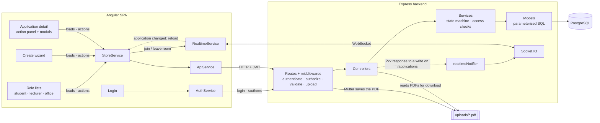

# Overseas Mobility

A full-stack web app that tracks a Ca' Foscari student's study period at a partner university abroad, from the learning agreement to exam recognition, for the student, the referent lecturer and the international office.

[](LICENSE)


**Live demo:** https://tommasomoro8.github.io/overseas-student-management/demo.html <!-- TODO: enable GitHub Pages (Settings → Pages → branch main, folder /docs) so this link works -->

<!-- portfolio:summary
## The problem
Ca' Foscari's Overseas programme sends students to partner universities outside Europe, and each stay needs a learning agreement, approvals, plan changes and exam recognition shared by student, lecturer and office. My Web Applications and Technologies exam asked for an app to manage it.

## The solution
A web app with one view per role, driven by an 11-state workflow. Students create applications and upload PDFs with their exam plan and grades, and lecturers approve or reject them with a reason. The office checks the pre-departure phase and closes the file.

## Technical challenges
- Every state change is checked against a table of allowed transitions, inside a transaction that locks the row.
- Each learning agreement version keeps its own exam plan, so rejecting a change reactivates the previous one.
- Socket.IO only says which application changed, and the client reloads it over HTTP.

## What I learned
- Documenting a project properly: ER diagram, state machine, API reference and walkthroughs.
- Containerising three services with Docker Compose, with separate development and production setups.
- Angular with standalone components and signals, and TypeScript on both ends.

## Stack
Angular 18, TypeScript, Node.js, Express, PostgreSQL, Socket.IO, JWT, Zod, Multer, Docker, Nginx

## Recognition
- Graded 30 cum laude out of 30 in the Web Applications and Technologies exam.
-->

<!-- portfolio:start -->
## The problem

Ca' Foscari's Overseas programme lets students spend a semester or a year at a partner university outside Europe and have the exams they pass there recognised back home. Each stay goes through several administrative steps, shared between three people:

- **before departure**, the student picks a host university and a referent lecturer, lists the exams they plan to take abroad next to the Ca' Foscari exams they replace, and uploads a Learning Agreement. The lecturer approves or rejects it, then the international office checks the pre-departure phase;
- **during the stay**, the student records the actual arrival and return dates and can propose changes to the exam plan, which the lecturer approves or rejects. A rejected change must bring back the previous plan;
- **after returning**, the student uploads the Transcript of Records with grades and dates, the lecturer approves the exams, and the office closes the application.

This was my individual project for the Web Applications and Technologies exam (a.y. 2025/2026). The [exam assignment](https://github.com/tommasomoro8/overseas-student-management/blob/main/docs/EXAM_ASSIGNMENT.pdf) asked for this workflow as a REST backend in Node.js with Express, an Angular single-page app, and each component in its own Docker container.

## The solution

After login, each role lands on its own list of applications. Every row shows the phase and what the current user has to do next, such as "Carica il Learning Agreement" (upload the Learning Agreement) or "Valuta la modifica proposta" (evaluate the proposed change).

- **Students** create an application by choosing academic year, host university, expected period and referent lecturer. They upload the Learning Agreement PDF together with the exam mapping, enter mobility dates, propose changes and upload the Transcript with a grade and date for every exam.
- **Referent lecturers** see only the applications they follow. They download the PDF, check the mapping and approve or reject. A rejection needs a reason.
- **The office** sees every application, with counters and status filters. It confirms the pre-departure check and closes applications whose exams have been approved.

The detail page of an application shows a timeline of every step with who did it and when, all versions of each document with their outcome, and the history of proposed changes. If two people have the same application open, an action by one refreshes the other's page.


The interface is in Italian. The [demo](https://tommasomoro8.github.io/overseas-student-management/demo.html) runs the same Angular app in the browser with an in-memory copy of the backend logic. Instead of the login it shows three buttons, one per role, with sample applications already in every state. Reloading the page resets the data.

## Technical challenges

- **A workflow that can't be skipped.** An application moves through 11 states, from `DRAFT` to `CLOSED`. The allowed transitions are listed in one table (`ALLOWED_TRANSITIONS`), and every action checks against it and answers `409` if the move isn't allowed. The check runs inside a transaction that first locks the row with `SELECT … FOR UPDATE`, so two concurrent requests can't both move the same application.
- **Versioned documents and undoing a rejected change.** Every upload of a Learning Agreement or Transcript is a new version, and a partial unique index allows only one active version per application. The exam mapping is stored per Learning Agreement version, not per application. When the lecturer rejects a change proposed during the stay, the backend deactivates the new version and reactivates the previous one, and the old plan comes back with it. Nothing is copied or deleted.
- **Complete grades before approval.** The Transcript upload must include a grade and date for exactly the exams in the active mapping, no more and no fewer. The lecturer can't approve it while any exam is missing a grade, and only then can the office close the application.
- **Real-time updates without duplicating the API.** One Express middleware watches every successful write under `/applications` and emits events through Socket.IO: one to the room of the application that changed, and one to every other connected client so their list reloads. The events carry at most an id, and the client reloads the data over HTTP. The author of the action is excluded through an `X-Socket-Id` header, so their page doesn't reload twice. The controllers know nothing about it.

## What I learned

- Writing proper documentation for a project. The [report](https://github.com/tommasomoro8/overseas-student-management/blob/main/docs/REPORT.pdf) (in Italian) covers the architecture, ER diagram, state machine, every endpoint with JSON examples, the authentication flow and a walkthrough per role.
- Containerising three services with Docker Compose. Each Dockerfile has a development target with hot reload and a production target. In production Nginx serves the compiled app and forwards `/api` and `/socket.io` to the backend, so the browser only ever talks to one origin.
- Angular 18 with standalone components, signals and the new `@if`/`@for` syntax, plus TypeScript on both ends: the frontend has a type for every API response (`api.types.ts`).

## Stack

- **Frontend:** Angular 18 (standalone components, signals), RxJS, socket.io-client
- **Backend:** Node.js 20, Express 4, TypeScript 5, Socket.IO 4
- **Database:** PostgreSQL 16 with the `pg` driver and plain SQL, no ORM
- **Auth and validation:** JSON Web Tokens (`jsonwebtoken`), `bcryptjs`, Zod
- **Uploads:** Multer (PDF files on disk)
- **Deployment:** Docker, Docker Compose, Nginx

## Recognition

- Graded 30 cum laude out of 30 in the Web Applications and Technologies exam at Ca' Foscari University of Venice.
<!-- portfolio:end -->

## Architecture



- **Layers in the backend.** Routes chain the middlewares and the controller for each endpoint. Controllers read the request and shape the response. Services hold the rules: who can do what and which transition is allowed. Models are the only code that talks to PostgreSQL, always with parameterised queries. Access checks such as "only the referent lecturer" are written once in the application service and reused by the Learning Agreement and Transcript services.
- **No ORM.** The schema is created at startup in `db/schema.ts` with plain SQL, so I could use PostgreSQL enums, the partial unique index for the active version and `FOR UPDATE` locks directly. The script is idempotent, and the seed adds three test users and fourteen partner universities when `SEED=true`, as the exam assignment required.
- **Stateless authentication.** Login returns a JWT signed with `JWT_SECRET`. The Angular app stores it in `localStorage` and an interceptor adds it to every request. On a `401` during a session it logs the user out.
- **Navigation through the store.** The app has three views (list, create, detail). Instead of `@angular/router`, a signal in `StoreService` holds the current view and the root component switches on it and on the user's role.
- **One origin in every environment.** In development the Angular dev server proxies `/api` and `/socket.io` to the backend (`proxy.conf.js`). In production Nginx does the same (`nginx.conf`). The app always uses relative URLs.
- **The demo.** The `demo` build configuration swaps two files: the app config adds an interceptor that answers every `/api/v1` call from an in-memory port of the services (`src/frontend/src/demo/`), and the login becomes the account picker. A script inlines the result into the single file `docs/demo.html`.

## Running locally

**Prerequisites:** Docker with Docker Compose.

All commands run from `src/`:

```bash
cd src

# development: Angular dev server with hot reload, backend with nodemon
docker compose up --build
# app:     http://localhost:4200
# backend: http://localhost:3000 (GET /health)

# production: compiled app served by Nginx, the only exposed port
docker compose -f docker-compose.prod.yml -p taw-prod up --build -d
# app:     http://localhost:8080
```

The backend creates the database schema at startup and, with `SEED=true`, adds three test accounts, all with the password `Ciao1234!`:

| Role | Email |
| --- | --- |
| Student | `studente@unive.it` |
| Referent lecturer | `docente@unive.it` |
| Office | `office@unive.it` |

**Configuration.** The Compose files set every variable. To run the backend outside Docker, copy `src/backend/.env.example` to `src/backend/.env` and point `DB_HOST` to a PostgreSQL 16 instance. Then run `npm install` and `npm run dev` in `src/backend` and `npm start` in `src/frontend`. In production set your own `JWT_SECRET`: the backend refuses to start without one when `NODE_ENV=production`.

**Dev container.** Opening `src/` in VS Code offers to reopen it inside the backend container (`src/.devcontainer/`).

**Rebuilding the demo.** From `src/frontend`, `npm run build:demo` builds the demo configuration and writes `docs/demo.html`.

There are no automated tests.

## Repository structure

```
overseas-student-management/
├── src/
│   ├── backend/                  ← Express API in TypeScript
│   │   └── src/
│   │       ├── routes/           ← endpoints and middleware chains
│   │       ├── middlewares/      ← JWT, roles, Zod validation, PDF upload, errors, real-time notifier
│   │       ├── controllers/      ← request in, JSON out
│   │       ├── services/         ← business rules and state transitions
│   │       ├── models/           ← SQL queries
│   │       ├── db/               ← schema creation and seed data
│   │       └── realtime/         ← Socket.IO rooms and events
│   ├── frontend/                 ← Angular 18 app
│   │   ├── src/app/core/         ← services, API types, mappers, interceptor
│   │   ├── src/app/features/     ← login, lists, create wizard, application detail
│   │   ├── src/app/ui/           ← reusable components: buttons, badges, modals, timeline
│   │   ├── src/demo/             ← in-memory backend and account picker for the demo build
│   │   ├── scripts/build-demo.mjs ← builds docs/demo.html
│   │   └── nginx.conf            ← production server and reverse proxy
│   ├── docker-compose.yml        ← development stack
│   ├── docker-compose.prod.yml   ← production stack
│   └── .devcontainer/            ← VS Code dev container
├── docs/
│   ├── demo.html                 ← self-contained demo
│   ├── EXAM_ASSIGNMENT.pdf       ← exam assignment from the course
│   ├── REPORT.md, REPORT.pdf     ← exam report (in Italian)
│   └── screenshots/              ← images used in this README and in the report
├── README.md
├── LICENSE
└── portfolio.yml                 ← metadata for my portfolio
```

## Known limitations and future work

- Some features exist only as API endpoints, with no screen: student registration (`POST /auth/register`), creating lecturer and office accounts (`POST /auth/staff`) and managing partner universities (`POST`, `PUT`, `DELETE /institutions`).
- The exam assignment lists a "cancelled" status, but there isn't one. An application can't be withdrawn or deleted.
- Socket.IO connections aren't authenticated. Any client can join the room of any application and receives the `applications-changed` event for every change. The events carry only ids, never data.
- In the production stack, uploaded PDFs live inside the backend container with no volume, so they're lost when the container is recreated. The database has its own volume.
- Views have no URL. Reloading the page always goes back to the list, and the browser's back button leaves the app.
- There are no automated tests.
- The interface is in Italian only.

What I would do next:

- **Routing with `@angular/router`**, with `/applications`, `/applications/new` and `/applications/:id`. Every application would get a link to share, and reload and the back button would work.
- **Authenticated sockets.** I would send the JWT in the Socket.IO handshake, run the same `canReadApplication` check before a client joins a room, and send list updates only to the users who can see that application.
- **Tests on the state machine.** Service tests against a throwaway PostgreSQL database, one for each allowed and forbidden transition, plus the rejected-change restore and the "all grades present" rule.
- **One copy of the rules.** The demo currently repeats the service logic in `demo-db.ts`. I would move the transition table and the checks into a small shared TypeScript package used by both the backend and the demo, so the two can't drift apart.
- **A volume for uploads** in `docker-compose.prod.yml`, or object storage, so documents survive a redeploy.
- **Cancellation.** A `CANCELLED` state, which the exam assignment lists among the statuses, reachable from the pre-departure states so a student can withdraw before leaving.

## Credits and license

- Design, backend, frontend and documentation: Tommaso Moro.
- The [exam assignment](https://github.com/tommasomoro8/overseas-student-management/blob/main/docs/EXAM_ASSIGNMENT.pdf) comes from the Web Applications and Technologies course, Ca' Foscari University of Venice, a.y. 2025/2026.

The code is released under the [MIT License](LICENSE).

---

Created by Tommaso Moro in June 2026.
