---
puppeteer:
  format: "A4"
  margin:
    top: "2cm"
    bottom: "2cm"
    left: "2cm"
    right: "2cm"
---
<style>
.mermaid {
  text-align: center;
}
.mermaid svg {
  display: block;
  margin: 0 auto;
  width: 100%;
  max-width: 850px;
  height: auto;
}
img {
  display: block;
  margin: 14px auto; 
  max-width: 100%;
  height: auto;
  border: 1px solid #d9d9d9;
  border-radius: 6px;
}
</style>

# Overseas Mobility — Report di Progetto

**Corso:** Tecnologie e Applicazioni Web 2025/2026<br>**Autore:** Tommaso Moro (Mat. 905964)<br>**Applicazione:** Gestione delle domande di mobilità internazionale

---

## Indice

1. [Architettura del sistema](#1-architettura-del-sistema)
2. [Modello dei dati](#2-modello-dei-dati)
3. [API REST](#3-api-rest)
4. [Autenticazione](#4-autenticazione-degli-utenti)
5. [Front end Angular](#5-front-end-angular)
6. [Esempi di workflow per ruolo](#6-esempi-di-workflow-per-ruolo)
7. [Utilizzo di strumenti di AI](#7-utilizzo-di-strumenti-di-ai)

---

## 1. Architettura del sistema

L'applicazione gestisce il ciclo di vita completo di una **domanda di mobilità internazionale**: dalla creazione della domanda da parte dello studente, all'invio e valutazione del *Learning Agreement*, alla verifica pre-partenza dell'ufficio, alla mobilità vera e propria con eventuali modifiche al piano esami, fino al caricamento e all'approvazione del *Transcript of Records* e alla chiusura della pratica.

### 1.1 Stile architetturale

Il sistema adotta un'architettura **a tre strati**, con netta separazione tra presentazione, logica applicativa e persistenza, interamente containerizzata con Docker Compose.
<br>
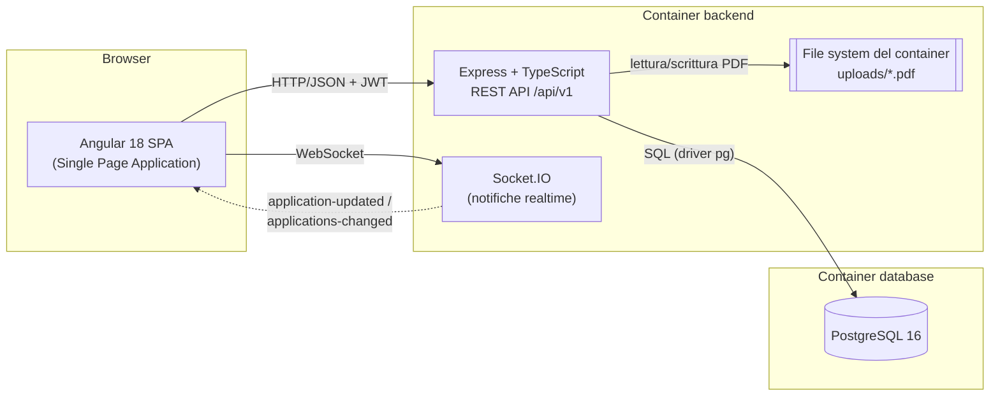
<br>
I tre servizi sono orchestrati da `docker-compose.yml`:

| Servizio | Immagine / base | Porta | Ruolo |
|----------|-----------------|-------|-------|
| `database` | `postgres:16` | 5432 | Persistenza relazionale, volume `pgdata` |
| `backend` | Node 20 (Express/TS) | 3000 | API REST + WebSocket + storage PDF |
| `frontend` | Node 20 (Angular dev-server in dev); build statica servita da Nginx in prod | 4200 / 80 | SPA Angular |

In sviluppo il dev-server di Angular fa da **proxy** (`frontend/proxy.conf.js`): inoltra `/api` e `/socket.io` verso il backend, così la SPA usa sempre percorsi relativi e si evitano problemi di CORS e URL hard-coded.

In produzione il dev-server non viene usato: la SPA viene **compilata** (`ng build`) e i file statici sono serviti da **Nginx**, che fa anche da **reverse proxy** inoltrando `/api` e `/socket.io` al backend — lo stesso ruolo del proxy di sviluppo, così anche in produzione si usano percorsi relativi (niente CORS, niente URL hard-coded). La configurazione è in `frontend/nginx.conf`; lo stack di produzione è descritto in `docker-compose.prod.yml` (build con i target `production`, backend e database non esposti sull'host: l'unico ingresso è Nginx).

### 1.2 Componenti del backend e loro relazioni

Il backend è organizzato a **livelli**, con responsabilità ben separate. Una richiesta attraversa i livelli nel seguente modo:

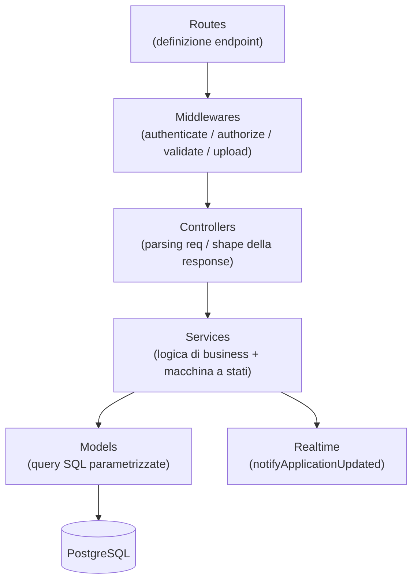

- **Routes** (`src/routes/`): dichiarano gli endpoint e compongono la catena di middleware. Il router radice monta i sotto-router su `/api/v1`. Learning Agreement e Transcript sono **sotto-risorse** delle applications (`/applications/:id/learning-agreements`, `mergeParams: true`).
- **Middlewares** (`src/middlewares/`):
  - `auth.middleware` → `authenticate` (verifica JWT) e `authorize(...roles)` (Role-Based Access Control);
  - `validate.middleware` → validazione del body con **Zod** e parsing dei campi JSON inviati come stringa nei form multipart (`parseJsonFields`);
  - `upload.middleware` → **Multer** per l'upload di un singolo PDF (nome generato via UUID, filtro MIME, limite 10 MB);
  - `error.middleware` → gestione centralizzata degli errori (`AppError` → risposta coerente; errori di body-parser → 400; tutto il resto → 500 generico);
  - `realtime.middleware` → dopo ogni mutazione andata a buon fine su una application emette la notifica realtime.
- **Controllers** (`src/controllers/`): sottili. Estraggono i parametri dalla richiesta, invocano il service e formattano la risposta JSON. Wrappati in `asyncHandler` per propagare gli errori asincroni all'error handler.
- **Services** (`src/services/`): cuore della logica di dominio. Implementano le **guardie di autorizzazione** (es. solo lo studente proprietario, solo il docente referente) e la **macchina a stati**. Le transizioni avvengono dentro una **transazione** con `SELECT ... FOR UPDATE` per evitare race condition.
- **Models** (`src/models/`): unico punto che parla con il database, tramite il driver `pg` con **query parametrizzate** (niente SQL injection). Restituiscono righe `snake_case` che i service convertono nei DTO (Data Transfer Object) pubblici `camelCase` (`utils/mobilityMappers.ts`).
- **Config / utils** (`src/config/`, `src/utils/`): configurazione tipizzata e centralizzata dell'ambiente (`env.ts`), pool di connessione e helper transazionale (`db.ts` → `withTransaction`), firma/verifica JWT, hashing bcrypt, `AppError`.

All'avvio (`server.ts`) il backend: (1) inizializza lo schema in modo **idempotente** (`initDb`), (2) esegue il *backfill* delle bandiere delle istituzioni, (3) opzionalmente fa il **seed** degli utenti/istituzioni di test, (4) avvia il server HTTP condiviso tra Express e Socket.IO.

### 1.3 Componente realtime

Il livello realtime è volutamente **"leggero"**: il backend non spinge i dati, ma si limita a segnalare ai client che una pratica è cambiata. Ricevuta la segnalazione, il client ricarica il dettaglio via HTTP. Questo mantiene una **singola fonte di verità** (le API REST) ed evita di duplicare la logica di serializzazione sul canale WebSocket.

- Eventi server → client: `application-updated` (a chi sta guardando la pratica, stanza `app:<id>`) e `applications-changed` (broadcast a chi è in lista).
- L'autore dell'azione viene **escluso** dalla notifica tramite l'header `X-Socket-Id` inviato dall'interceptor (ha già i dati aggiornati: niente doppio reload).

### 1.4 Stack tecnologico

| Ambito | Tecnologie |
|--------|-----------|
| Front end | Angular 18 (standalone components, Signals, control-flow `@if/@for`), RxJS, socket.io-client |
| Back end | Node.js 20, Express 4, TypeScript 5, Socket.IO 4 |
| Database | PostgreSQL 16 (driver `pg`, SQL nativo, nessun ORM) |
| Sicurezza | `jsonwebtoken` (JWT), `bcryptjs` (hashing password) |
| Validazione | `zod` (schema di input) |
| Upload | `multer` (PDF su file system) |
| Dev/Deploy | Docker, Docker Compose, Nginx (serving statico + reverse proxy in prod), Prettier |

---

## 2. Modello dei dati

Il database è **relazionale** (PostgreSQL). Lo schema è creato in modo idempotente da `src/db/schema.ts` ed è progettato attorno a tre idee chiave:

1. **Domanda (`applications`) come aggregato centrale**, con riferimenti a studente, docente referente e istituzione ospitante.
2. **Documenti versionati**: Learning Agreement e Transcript of Records sono storicizzati (ogni invio è una nuova versione); un indice univoco parziale garantisce **una sola versione attiva** per domanda.
3. **Mapping esami come contenuto di una versione di Learning Agreement**: l'equivalenza esame estero ↔ esame interno è uno *snapshot* legato alla versione del LA, così il ripristino dopo un rifiuto è un semplice *toggle* del flag `is_active`.

### 2.1 Diagramma ER

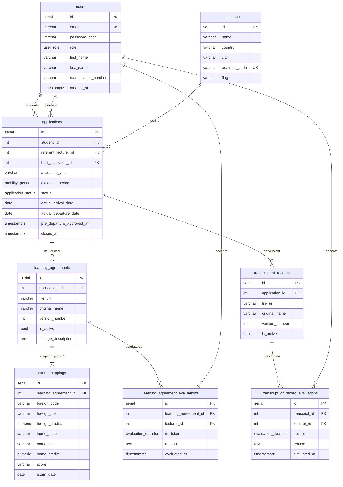

\* La relazione `learning_agreements → exam_mappings` è **uno-a-molti obbligatoria** (almeno un esame per versione): un Learning Agreement viene creato sempre insieme al suo piano esami. Il vincolo non è espresso dalla foreign key — che imporrebbe solo *zero o molti* — ma è garantito dalla logica applicativa (`learningAgreement.service.ts`: il mapping è obbligatorio al primo invio e viene riportato nelle versioni successive).

### 2.2 Tipi enumerati (ENUM PostgreSQL)

| ENUM | Valori |
|------|--------|
| `user_role` | `student`, `lecturer`, `office` |
| `application_status` | `DRAFT`, `LA_SUBMITTED`, `LA_APPROVED`, `LA_REJECTED`, `PRE_DEPARTURE_APPROVED`, `MOBILITY_IN_PROGRESS`, `LA_CHANGE_SUBMITTED`, `TOR_SUBMITTED`, `TOR_APPROVED`, `TOR_REJECTED`, `CLOSED` |
| `evaluation_decision` | `APPROVED`, `REJECTED` |
| `mobility_period` | `FIRST_SEMESTER`, `SECOND_SEMESTER`, `FULL_YEAR` |

### 2.3 Descrizione delle tabelle

- **`users`** — Account del sistema (tre ruoli). Lo studente ha la `matriculation_number`; docente e ufficio no. Email univoca, password salvata come hash bcrypt.
- **`institutions`** — Atenei partner ospitanti. `erasmus_code` univoco; `flag` (emoji bandiera) derivata dal paese a livello applicativo se non inserita quando viene creata l'institution.
- **`applications`** — Domanda di mobilità: collega studente, referente e istituzione; contiene anno accademico, periodo previsto, **stato corrente** e le marche temporali delle tappe (date effettive di mobilità, verifica pre-partenza, chiusura). Indicizzata su `student_id`, `referent_lecturer_id`, `status`, `host_institution_id`.
- **`learning_agreements`** — Versioni del Learning Agreement (file PDF + numero di versione + flag attivo). `change_description` valorizzata solo per le modifiche proposte *durante* la mobilità. Vincolo `UNIQUE(application_id, version_number)` e indice univoco parziale `uq_la_one_active` (una sola versione attiva per domanda).
- **`exam_mappings`** — Righe del piano di equivalenza esami, **legate alla versione del LA**. `score` ed `exam_date` restano vuoti fino al rientro (fase Transcript).
- **`transcript_of_records`** — Versioni del Transcript of Records (stessa logica di versioning del LA).
- **`learning_agreement_evaluations` / `transcript_of_record_evaluations`** — Decisione del docente (`APPROVED`/`REJECTED`) su una specifica versione del documento, con `reason` (obbligatoria solo in caso di rifiuto).

### 2.4 Macchina a stati della domanda

Lo stato della domanda è il cuore del dominio. Le transizioni ammesse sono dichiarate in `src/types/application.types.ts` (`ALLOWED_TRANSITIONS`) e verificate dal backend (`assertTransition`, errore **409** se illegale).

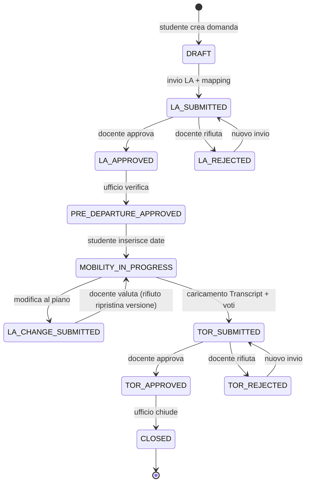

---

## 3. API REST

Tutte le API sono esposte sotto il prefisso **`/api/v1`** e scambiano dati in **JSON** (eccetto upload e download di PDF, che usano `multipart/form-data` e `application/pdf`). Le risposte di successo incapsulano la risorsa in una chiave (`{ application: ... }`, `{ applications: [...] }`); gli errori hanno forma `{ "error": "messaggio", "details"?: ... }`.

### 3.1 Convenzioni

- **Autenticazione**: header `Authorization: Bearer <JWT>` su tutte le rotte tranne `register` e `login`.
- **Autorizzazione**: indicata nella colonna *Ruoli*. Oltre al ruolo, valgono guardie a livello di risorsa (es. lo studente vede solo le proprie domande, il docente solo quelle in cui è referente).
- **Codici di stato**: `200` ok, `201` creato, `204` nessun contenuto, `400` input non valido, `401` non autenticato, `403` permessi insufficienti, `404` non trovato, `409` transizione di stato/conflitto, `500` errore interno del server.

### 3.2 Elenco degli endpoint

#### Autenticazione — `/api/v1/auth`

| Metodo | Endpoint | Ruoli | Descrizione |
|--------|----------|-------|-------------|
| POST | `/auth/register` | pubblico | Registra uno studente, restituisce utente + token |
| POST | `/auth/login` | pubblico | Login con email/password, restituisce utente + token |
| GET | `/auth/me` | autenticato | Dati dell'utente corrente |
| POST | `/auth/staff` | office | Crea un account docente o ufficio |

#### Utenti / Istituzioni

| Metodo | Endpoint | Ruoli | Descrizione |
|--------|----------|-------|-------------|
| GET | `/users/lecturers` | autenticato | Elenco lecturers |
| GET | `/institutions` | autenticato | Elenco istituzioni |
| GET | `/institutions/:id` | autenticato | Dettaglio istituzione |
| POST | `/institutions` | office | Crea istituzione |
| PUT | `/institutions/:id` | office | Aggiorna istituzione |
| DELETE | `/institutions/:id` | office | Elimina istituzione |

#### Domande di mobilità — `/api/v1/applications`

| Metodo | Endpoint | Ruoli | Descrizione |
|--------|----------|-------|-------------|
| GET | `/applications?status=` | autenticato | Elenco filtrato per ruolo (filtra inoltre opzionalmente per application_status) |
| GET | `/applications/:id` | partecipanti/office | Dettaglio completo (documenti, valutazioni, esami, timeline) |
| POST | `/applications` | student | Crea una domanda (application_status: `DRAFT`) |
| POST | `/applications/:id/pre-departure-approval` | office | application_status: `LA_APPROVED` → `PRE_DEPARTURE_APPROVED` |
| POST | `/applications/:id/mobility-dates` | student | Inserisce/aggiorna le date effettive (avvia la mobilità) |
| POST | `/applications/:id/close` | office | application_status: `TOR_APPROVED` → `CLOSED` |

#### Learning Agreement (sotto-risorsa) — `/applications/:id/learning-agreements`

| Metodo | Endpoint | Ruoli | Descrizione |
|--------|----------|-------|-------------|
| GET | `/` | partecipanti/office | Storico versioni + mapping + valutazioni |
| POST | `/` *(multipart)* | student | Invia una versione (PDF + mapping / descrizione modifica) |
| GET | `/:laId/file` | partecipanti/office | Download del PDF |
| POST | `/:laId/evaluate` | lecturer (referente) | Approva o rifiuta la versione attiva |

#### Transcript of Records (sotto-risorsa) — `/applications/:id/transcripts`

| Metodo | Endpoint | Ruoli | Descrizione |
|--------|----------|-------|-------------|
| GET | `/` | partecipanti/office | Storico versioni + valutazioni |
| POST | `/` *(multipart)* | student | Carica una versione (PDF + voti/date di tutti gli esami) |
| GET | `/:torId/file` | partecipanti/office | Download del PDF |
| POST | `/:torId/evaluate` | lecturer (referente) | Approva o rifiuta la versione attiva |

### 3.3 Esempi in formato JSON

**Registrazione** — `POST /api/v1/auth/register`

```json
// Request
{
  "email": "nuovostudente@unive.it",
  "password": "Ciao1234!",
  "firstName": "Giorgia",
  "lastName": "Manao",
  "matriculationNumber": "894377"
}
```
```json
// Response 201
{
  "user": {
    "id": 7, "email": "nuovostudente@unive.it", "role": "student",
    "firstName": "Giorgia", "lastName": "Manao",
    "matriculationNumber": "894377", "createdAt": "2026-06-05T10:12:00.000Z"
  },
  "token": "eyJhbGciOiJIUzI1NiIsInR5cCI6IkpXVCJ9..."
}
```

**Login** — `POST /api/v1/auth/login`

```json
// Request
{
  "email": "docente@unive.it",
  "password": "Ciao1234!"
}
```
```json
// Response 200
{
  "user": { "id": 2, "email": "docente@unive.it", "role": "lecturer",
            "firstName": "Filippo", "lastName": "Bergamasco",
            "matriculationNumber": null, "createdAt": "2026-06-01T08:00:00.000Z" },
  "token": "eyJhbGciOiJIUzI1NiI..."
}
```

**Creazione domanda** — `POST /api/v1/applications` *(ruolo student)*

```json
// Request
{
  "referentLecturerId": 2,
  "hostInstitutionId": 1,
  "academicYear": "2026/2027",
  "expectedPeriod": "FIRST_SEMESTER"
}
```
```json
// Response 201
{
  "application": {
    "id": 12, "studentId": 7, "referentLecturerId": 2, "hostInstitutionId": 1,
    "academicYear": "2026/2027", "expectedPeriod": "FIRST_SEMESTER",
    "status": "DRAFT", "actualArrivalDate": null, "actualDepartureDate": null,
    "createdAt": "2026-06-05T10:20:00.000Z", "updatedAt": "2026-06-05T10:20:00.000Z"
  }
}
```

**Invio Learning Agreement** — `POST /api/v1/applications/12/learning-agreements` *(multipart/form-data)*

```
file:         <Learning_Agreement.pdf>         (campo file, PDF)
examMappings: <stringa JSON, vedi sotto>        (campo testo)
```
```json
// Contenuto del campo "examMappings"
[
  {
    "foreignCode": "MATH-501", "foreignTitle": "Advanced Calculus", "foreignCredits": 6,
    "homeCode": "CT0111", "homeTitle": "Analisi Matematica 2", "homeCredits": 6
  },
  {
    "foreignCode": "CS-220", "foreignTitle": "Distributed Systems", "foreignCredits": 9,
    "homeCode": "CT0573", "homeTitle": "Sistemi Distribuiti", "homeCredits": 9
  }
]
```
```json
// Response 201
{
  "learningAgreement": {
    "id": 30, "applicationId": 12, "versionNumber": 1, "isActive": true,
    "originalName": "Learning_Agreement.pdf", "changeDescription": null,
    "evaluation": null, "examMappings": [ /* ... */ ],
    "uploadedAt": "2026-06-05T10:25:00.000Z"
  },
  "application": { "id": 12, "status": "LA_SUBMITTED", "...": "..." }
}
```

**Valutazione (rifiuto)** — `POST /api/v1/applications/12/learning-agreements/30/evaluate` *(ruolo lecturer referente)*

```json
// Request
{ "decision": "REJECTED", "reason": "Crediti insufficienti per Sistemi Distribuiti" }
```
```json
// Response 200
{
  "evaluation": { "id": 5, "lecturerId": 2, "decision": "REJECTED",
                  "reason": "Crediti insufficienti per Sistemi Distribuiti",
                  "evaluatedAt": "2026-06-05T11:00:00.000Z" },
  "application": { "id": 12, "status": "LA_REJECTED", "...": "..." }
}
```

**Inserimento date di mobilità** — `POST /api/v1/applications/12/mobility-dates`

```json
// Request
{ "actualArrivalDate": "2026-09-01", "actualDepartureDate": "2027-02-15" }
```
```json
// Response 200
{
  "application": { "id": 12, "status": "MOBILITY_IN_PROGRESS", "...": "..." }
}
```

**Caricamento Transcript** — `POST /api/v1/applications/12/transcripts` *(multipart/form-data)*

```
file:    <Transcript_of_Records.pdf>      (campo file, PDF)
results: <stringa JSON, vedi sotto>        (campo testo)
```
```json
// Contenuto del campo "results": voto e data per OGNI esame del mapping attivo
[
  { "examMappingId": 41, "score": "28", "examDate": "2027-01-20" },
  { "examMappingId": 42, "score": "30L", "examDate": "2027-02-03" }
]
```
```json
// Response 201
{
  "transcript": {
    "id": 15, "applicationId": 12, "versionNumber": 1, "isActive": true,
    "originalName": "Transcript_of_Records.pdf", "evaluation": null,
    "uploadedAt": "2027-03-01T09:00:00.000Z"
  },
  "application": { "id": 12, "status": "TOR_SUBMITTED", "...": "..." }
}
```

**Formato degli errori** — tutte le risposte di errore condividono la stessa struttura: un campo `error` con il messaggio descrittivo e un campo `details` **opzionale** con contesto aggiuntivo (presente solo in alcuni casi, es. una transizione di stato non consentita). A distinguere il tipo di errore è il **codice di stato HTTP** (vedi legenda a inizio sezione).

```json
// Forma generale — lo status varia (400 / 401 / 403 / 404 / 409 / 500)
{
  "error": "<messaggio descrittivo dell'errore>",
  "details": { "...": "..." }   // opzionale
}
```

---

## 4. Autenticazione degli utenti

L'autenticazione è basata su **JSON Web Token (JWT)** *stateless*: il server non mantiene sessioni, l'identità viaggia nel token firmato a ogni richiesta.

### 4.1 Meccanismo

- **Registrazione/Login** producono un JWT firmato con `JWT_SECRET` (HS256), con scadenza configurabile (`JWT_EXPIRES_IN`, default 7 giorni). Il payload contiene `{ userId, email, role }`.
- Le **password** non sono mai salvate in chiaro: sono sottoposte a **hashing bcrypt** (`bcryptjs`, 10 round). Al login si confronta l'hash; in caso di email inesistente o password errata si risponde con lo stesso messaggio generico *"Credenziali non valide"* (per non rivelare quali email siano registrate).
- Il client salva il token in **`localStorage`** (`ovs_token`).
- Un **interceptor HTTP** Angular aggiunge automaticamente l'header `Authorization: Bearer <token>` a ogni chiamata; su risposta `401` durante una sessione attiva esegue il logout automatico.
- Lato server, `authenticate` verifica firma e scadenza del token e ricostruisce `req.user`; `authorize(...roles)` applica il **controllo di ruolo**. Oltre al ruolo, i service applicano guardie a livello di singola risorsa (proprietario / referente).

### 4.2 Ruoli e permessi

| Ruolo | Come si ottiene | Permessi principali |
|-------|-----------------|---------------------|
| `student` | Registrazione pubblica | Crea domande, invia LA/ToR, inserisce date, vede solo le proprie domande |
| `lecturer` | Creato dall'ufficio (`/auth/staff`) | Valuta LA, modifiche e Transcript delle domande in cui è **referente** |
| `office` | Creato dall'ufficio / seed | Verifica pre-partenza, chiude le pratiche, gestisce istituzioni e staff, vede **tutte** le domande |

### 4.3 Workflow di autenticazione

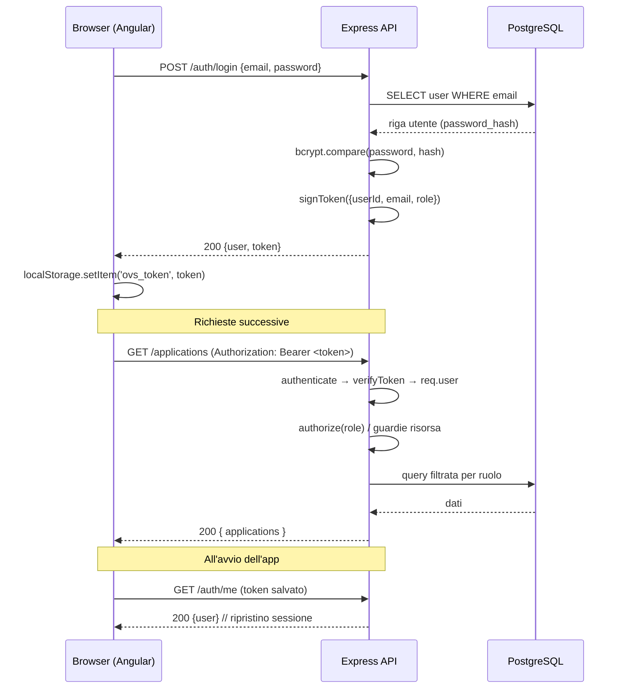

All'avvio la SPA prova a ripristinare la sessione: se trova un token, chiama `/auth/me`; se è valido ricarica l'utente, altrimenti pulisce il token e mostra la login.

---

## 5. Front end Angular

SPA in **Angular 18**, interamente a **standalone components** con **Signals** per lo stato reattivo, change detection `OnPush` e la nuova sintassi di control-flow (`@if`, `@for`, `@switch`).

### 5.1 Organizzazione e "routing"

La navigazione **non usa `@angular/router`**: è gestita dallo **store** tramite un signal `route` (`{ view: 'list' | 'detail' | 'create', appId }`). Il componente radice (`AppComponent`) funge da *shell* e da *gate* di autenticazione, scegliendo la vista in base allo stato di login e al ruolo dell'utente:

- non autenticato → `LoginComponent`;
- autenticato → appbar + vista corrente:
  - `view = 'create'` → wizard di creazione;
  - `view = 'detail'` → dettaglio domanda;
  - altrimenti la **lista del ruolo** (`student` / `lecturer` / `office`).

> *Nota di design:* trattandosi di una SPA con poche viste e un forte stato condiviso, la navigazione store-driven è stata preferita al router per semplicità; le tre "rotte logiche" restano **list**, **detail** e **create**.

### 5.2 Servizi (core)

| Servizio | Responsabilità |
|----------|----------------|
| `AuthService` | Login/logout, ripristino sessione, utente corrente come signal, gestione token |
| `ApiService` | Client HTTP verso `/api/v1` (applications, LA, transcript, istituzioni, docenti, download PDF) |
| `StoreService` | Stato applicativo: navigazione, liste/dettaglio (loading/errore), tutte le azioni del workflow, mapping DTO→view-model |
| `RealtimeService` | Connessione Socket.IO, *join/leave* delle stanze, ascolto eventi di aggiornamento |
| `ToastService` | Notifiche non bloccanti all'utente |
| `authInterceptor` | Aggiunge `Authorization` e `X-Socket-Id`; logout automatico su 401 |

I DTO grezzi del backend (`api.types.ts`) sono trasformati in **view-model di dominio** (`models.ts`) dai *mapper* (`mappers.ts`), che derivano fasi UI, stato dei documenti, modifiche e la **timeline** della pratica dal punto di vista del ruolo che la guarda.

### 5.3 Componenti

**Shell e feature**

| Componente | Ruolo |
|-----------|-------|
| `AppComponent` | Shell + gate di autenticazione + switch di vista |
| `LoginComponent` | Pagina di accesso |
| `AppbarComponent` | Barra superiore con utente e logout |
| `CreateWizardComponent` | Creazione nuova domanda (istituzione, referente, anno, periodo) |
| `StudentListComponent` / `LecturerListComponent` / `OfficeListComponent` | Liste filtrate per ruolo |
| `AppRowComponent`, `ListHeaderComponent` | Riga e intestazione di lista |
| `ApplicationDetailComponent` | Dettaglio completo di una pratica |
| `ActionPanelComponent` | Pannello azioni contestuale guidato dallo stato (invio LA, valutazioni, date, Transcript, chiusura) |
| `MetaBarComponent`, `DocsCardComponent`, `ModsCardComponent`, `DatesCardComponent`, `BoxComponent` | Schede del dettaglio (metadati, documenti, modifiche, date) |
| `DecisionModalComponent`, `LearningAgreementModalComponent`, `TranscriptModalComponent` | Modali per valutazione, invio LA + mapping, upload Transcript + voti |

**Componenti UI riutilizzabili** (`src/app/ui/`): `BtnComponent`, `BadgeComponent` / `ActionBadgeComponent`, `IconComponent`, `ModalComponent`, `DropzoneComponent` (upload PDF), `ExamTableComponent` (tabella mapping/voti), `TimelineComponent` (avanzamento della pratica), `ToastHostComponent`.

### 5.4 Rotte logiche

| Vista (route) | Quando | Componente |
|---------------|--------|-----------|
| `list` | Default dopo login | Lista del ruolo corrente |
| `create` | "Nuova application" (studente) | `CreateWizardComponent` |
| `detail` | Pagina di una pratica | `ApplicationDetailComponent` |

---

## 6. Esempi di workflow per ruolo

Questa sezione ripercorre il ciclo di vita di una domanda di mobilità dal punto di vista dei tre ruoli del sistema — **studente**, **docente referente** e **ufficio** — evidenziando come ciascuno interviene nelle diverse fasi della macchina a stati descritta nella sezione 2.4.
I passaggi sono illustrati con screenshot dell'applicazione in esecuzione, riprodotti con gli utenti demo precaricati dal *seed*:

| Ruolo | Utente demo |
|-------|-------------|
| Studente | `studente@unive.it` |
| Docente | `docente@unive.it` |
| Ufficio | `office@unive.it` |

(password comune **`Ciao1234!`**)

### 6.1 Studente

1. **Login** e atterraggio su *"Le mie applications"*.
   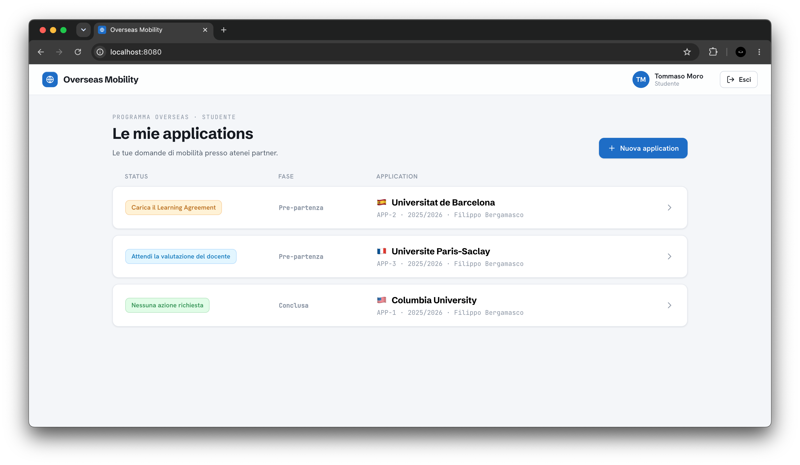
2. **Nuova application**: sceglie istituzione ospitante, docente referente, anno accademico e periodo → la domanda nasce in stato `DRAFT`.
   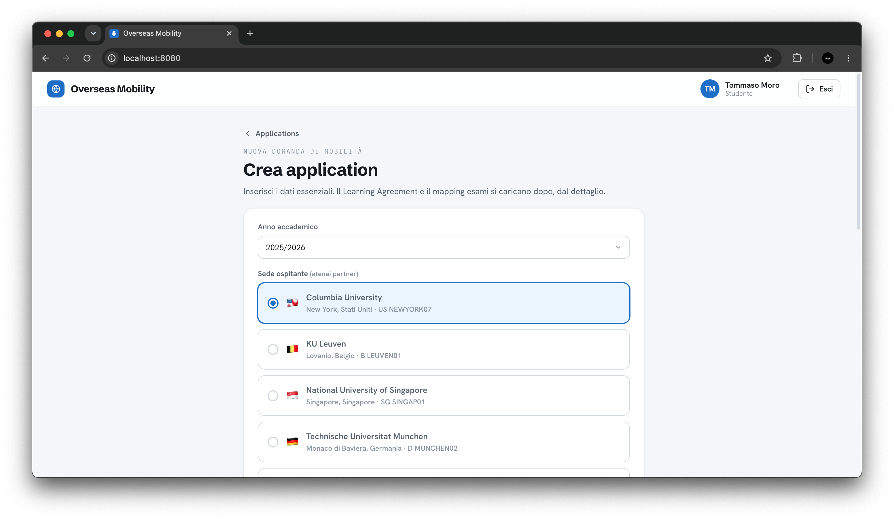
3. **Invio Learning Agreement**: carica il PDF e compila il **mapping esami** (estero ↔ Ca' Foscari) → stato `LA_SUBMITTED`.
   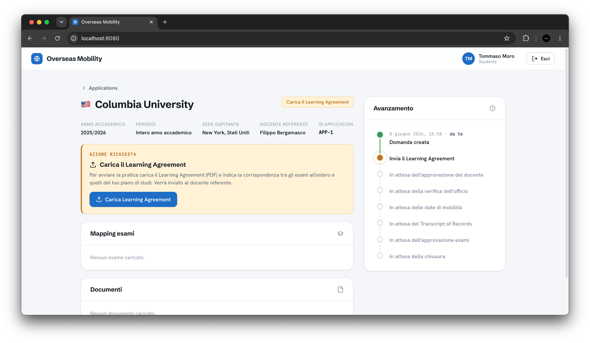
   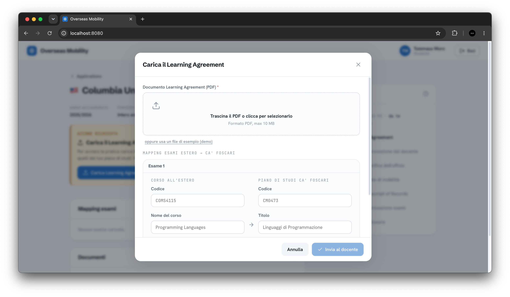
4. Dopo l'approvazione del docente e la verifica dell'ufficio, **inserisce le date** di arrivo/rientro → la mobilità parte (`MOBILITY_IN_PROGRESS`).
   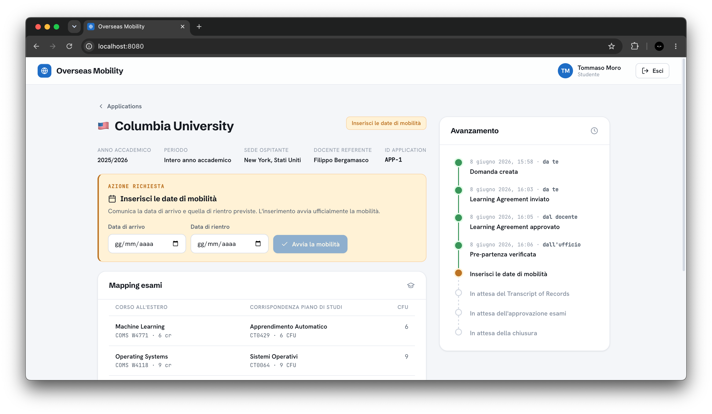
5. **Propone una modifica** al piano esami durante la mobilità (`LA_CHANGE_SUBMITTED`). (Opzionale)
6. Al rientro **carica il Transcript of Records** con voti e date di tutti gli esami → `TOR_SUBMITTED`.
   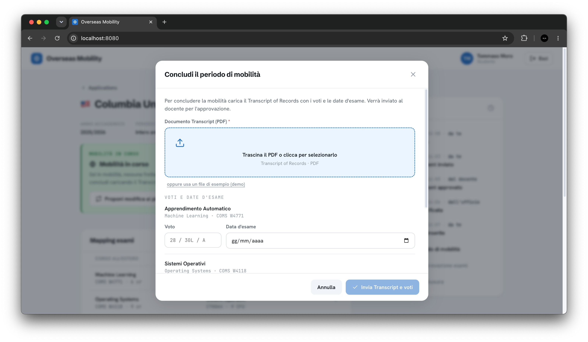

### 6.2 Docente referente

1. **Login** → *"Applications da seguire"*, con il numero di pratiche che richiedono la sua valutazione.
   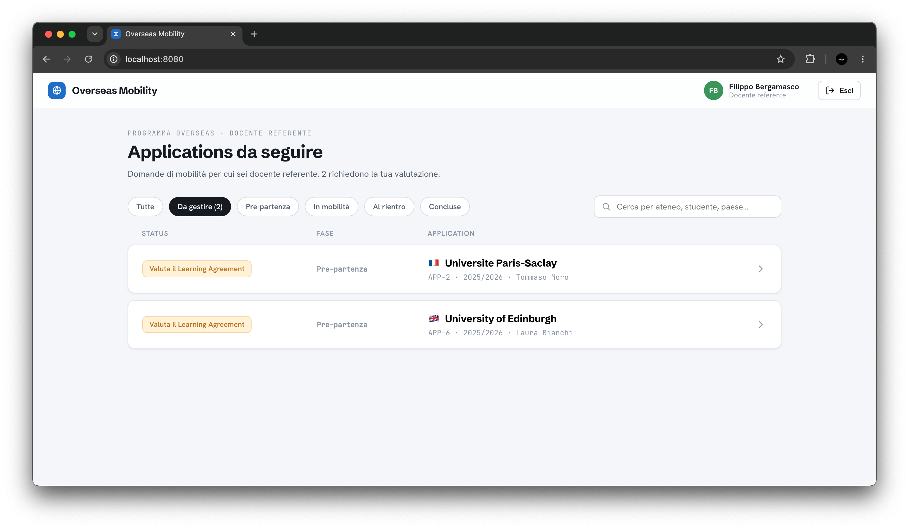
2. **Valuta il Learning Agreement**: apre la pratica, scarica il PDF, controlla il mapping e **approva** o **rifiuta** (con motivazione obbligatoria in caso di rifiuto).
   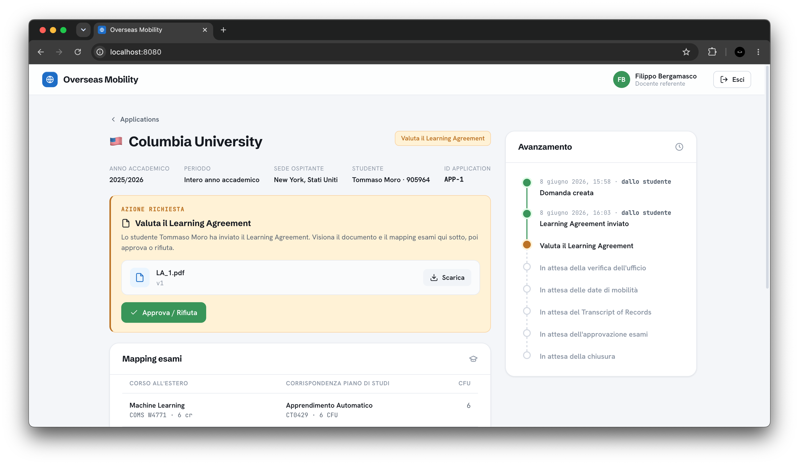
3. **Valuta le modifiche** proposte durante la mobilità (il rifiuto ripristina automaticamente la versione precedente del piano).
4. **Approva il Transcript**: verifica voti e date e chiude la fase esami (`TOR_APPROVED`).
   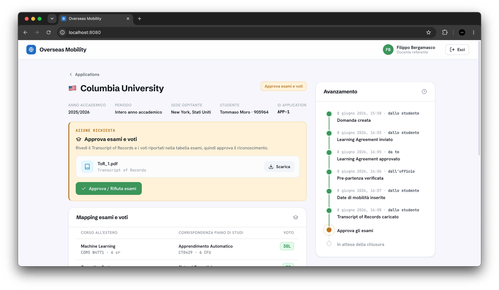

### 6.3 Ufficio (office)

1. **Login** → *"Tutte le applications"* con statistiche e filtri per stato.
   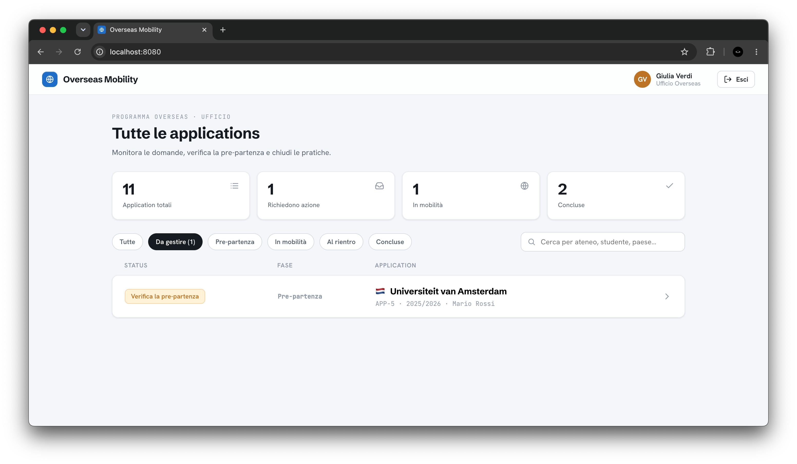
2. **Verifica la pre-partenza** per le domande con LA approvato (`LA_APPROVED → PRE_DEPARTURE_APPROVED`).
   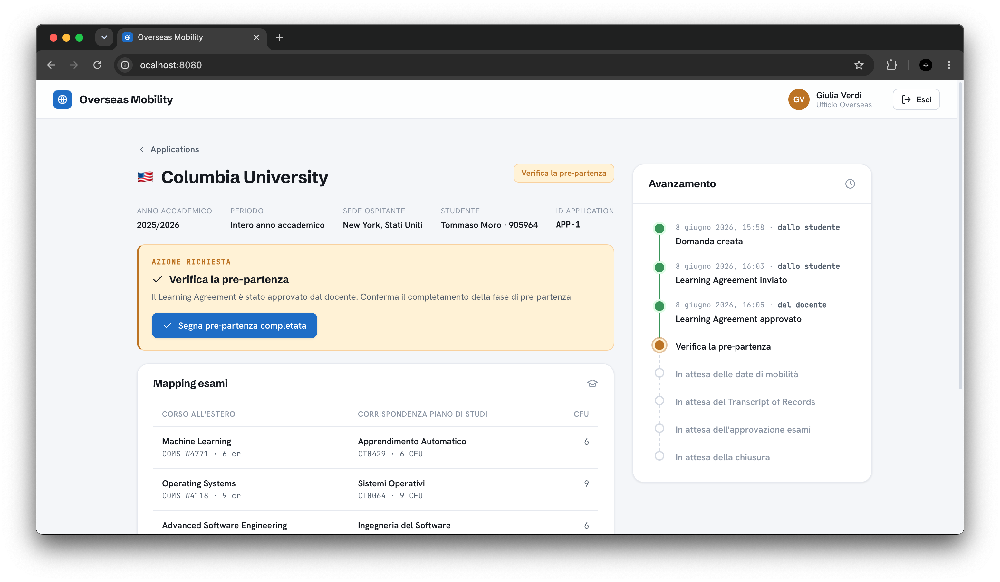
3. **Chiude la pratica** quando il Transcript è approvato (`TOR_APPROVED → CLOSED`).
   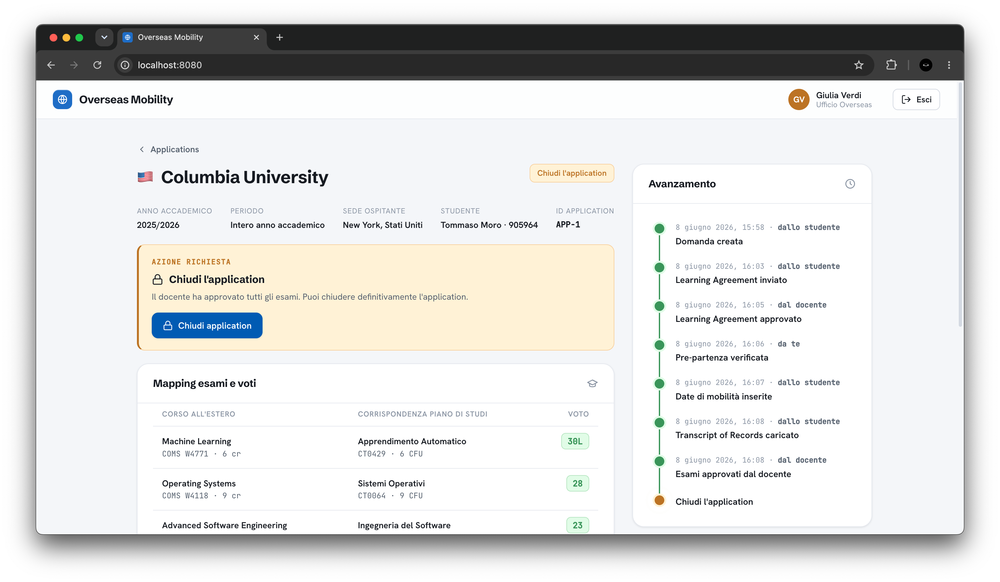

> **Realtime in azione:** quando due client hanno la stessa pratica aperta in due finestre, l'azione compiuta da uno aggiorna automaticamente la vista dell'altro grazie alle notifiche Socket.IO.

---

## 7. Utilizzo di strumenti di AI

Durante lo sviluppo del progetto è stato utilizzato un **assistente AI**, Claude Code di Anthropic, come strumento di supporto, impiegato in modo mirato per accelerare le parti più ripetitive del lavoro (boilerplate, codice di contorno, documentazione) a partire da requisiti e decisioni già definiti dallo sviluppatore. Le scelte progettuali e di dominio sono quindi rimaste interamente in capo allo sviluppatore; all'AI è stato delegato principalmente il lavoro di stesura più meccanico, sotto supervisione costante.

**Risultati ottenuti**

- Riduzione sensibile dei tempi di sviluppo, in particolare sul *boilerplate* e sulle parti ripetitive.
- Maggiore **coerenza** tra livelli (tipi condivisi, naming uniforme, gestione errori omogenea).
- Individuazione precoce di **casi limite** (transizioni illegali, ripristino di versioni dopo un rifiuto, completezza dei voti prima dell'approvazione del Transcript).

**Limiti e supervisione**

Ogni proposta dell'AI è stata **verificata e testata** manualmente (es. con Postman e provando i flussi nell'interfaccia): in alcuni casi i suggerimenti andavano corretti o adattati al contesto specifico del progetto. L'AI è stata quindi uno strumento di produttività, non un sostituto della comprensione e delle scelte progettuali, che restano responsabilità dello sviluppatore.

---

### Appendice — Come eseguire il progetto

```bash
# Dalla cartella src/ del progetto (cd src)

# --- Sviluppo (hot-reload, dev-server Angular con proxy /api) ---
docker-compose up --build      # avvia database, backend, frontend
# Frontend:  http://localhost:4200
# Backend:   http://localhost:3000  (health-check: GET /health)

# --- Produzione (build ottimizzate, SPA servita da Nginx con reverse proxy) ---
docker-compose -f docker-compose.prod.yml -p taw-prod up --build -d
# App (unico ingresso, via Nginx):  http://localhost:8080
```

All'avvio il backend crea lo schema (idempotente) e, se `SEED=true`, precarica utenti e istituzioni di test.
